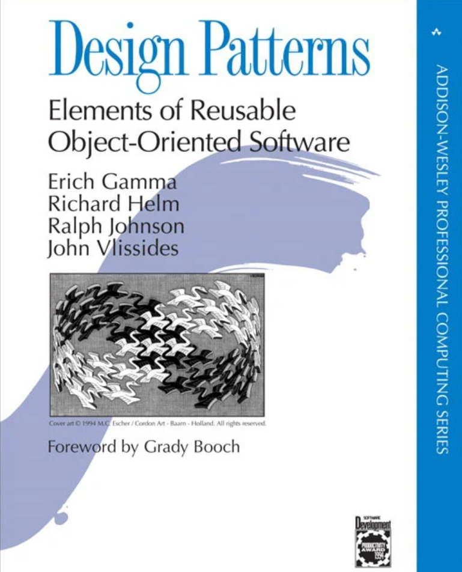

 

## Introduction

There is a common question that appears in most coding interviews for software engineers, well actually there are technically two and they are “What is a design pattern?” and “What design patterns do you tend to lean towards in your own work?”. Well to answer that question, the textbook definition of a design pattern is “a general, reusable solution to a commonly occurring problem in software design” (OpenAI, 2024). 

## What really is a design pattern?

While this definition does answer the question itself, it might seem very vague and might not provide a whole lot of insight as to what these problems are and how these designs work. Personally, I think a better definition of design patterns would be “a solution design template for common problems within structures in software”. The topic of design patterns was first popularized by the book “Design Patterns: Elements of Reusable Object Oriented Software” written by Erich Gamma, Richard Helm, Ralph Johnson, and John Vlissides, known also as the “Gang of Four”. Design patterns show how objects in programming interact in a general sense, without applying any final applications to these objects. A design pattern has a few unique qualities as listed; a informative description; a general problem description that states which particular design pattern would be the best fit for a specific problem; a solution description that describes how certain classes and objects behave in general in the context of software structure; and lastly consequences and trade-offs of using one design pattern versus another. There are three different types of design patterns and they consist of, creational, structural, and behavioral patterns. Creational patterns pertain to how objects are created within a structure, structural patterns represent collections of objects within the software, and behavioral patterns tend to manage the interactions between objects. 

## How different design patterns cater to different problems

Different design patterns have different advantages and disadvantages in certain aspects, which in turn can really make or break a solution. For example, the Factory design pattern has advantages over object oriented class constructors, such as the ability to return multiple different objects from different classes and the ability to build additional objects as needed. Some disadvantages to this design pattern would be that it is more complicated than object oriented class constructors. Another design pattern that could be considered an opposite of the Factory design pattern would be the Singleton design pattern. The Singleton design pattern has advantages that provide a “global state” in an object oriented manner, and it is also easier to implement. While some disadvantages of this design pattern would be that it is not normally thread-safe, meaning that this pattern requires a lot of care and frequent updates and it is generally discouraged to constantly be in a global state. 

## Works Cited
OpenAI. (2024). ChatGPT (April 25 version) [Large Language Model]. https://chat.openai.com/share/a2f95449-e06b-402f-8f28-99a9550c804e
