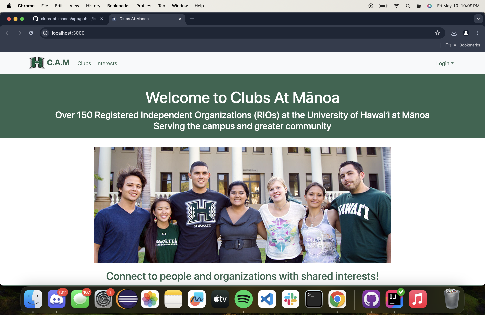

  

For the final project portion of our software engineering course ICS 314, my group and I choose to create a web application that would generate, house, and expand the information regarding all of the registered clubs at the University of Hawaii at Manoa.  
