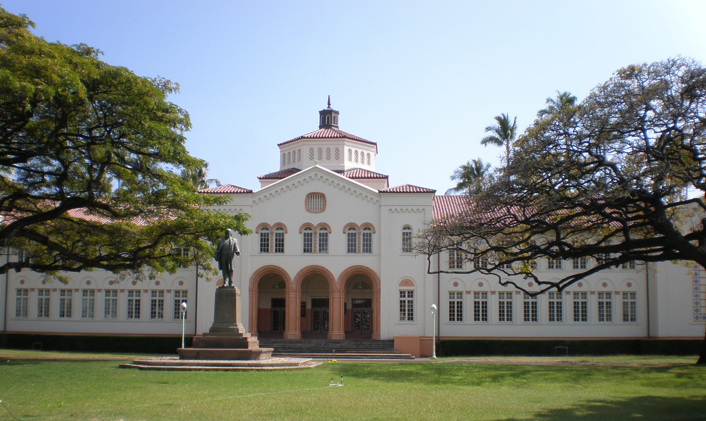

  

IGNITION is a program in which select upperclassmen are assigned a group freshman for the remainder of the school year to guide and support through their transition from middle school to highschool. IGNITION memembers are usually of junior or senior standing and are choosen carefully by faculty and staff throughout the year. 

Every month or so, IGNITION memebers meet with their respective upperclassmen peers to discuss the following activites that would take place for future meetups with their underclassmen. These activites usually consisted of ice breakers and get to know you games that had a purpose to encouraging freshman to grow out of their shell.  

You can learn more at the [Mckinley Highschool Website](https://www.mckinley.k12.hi.us/).
